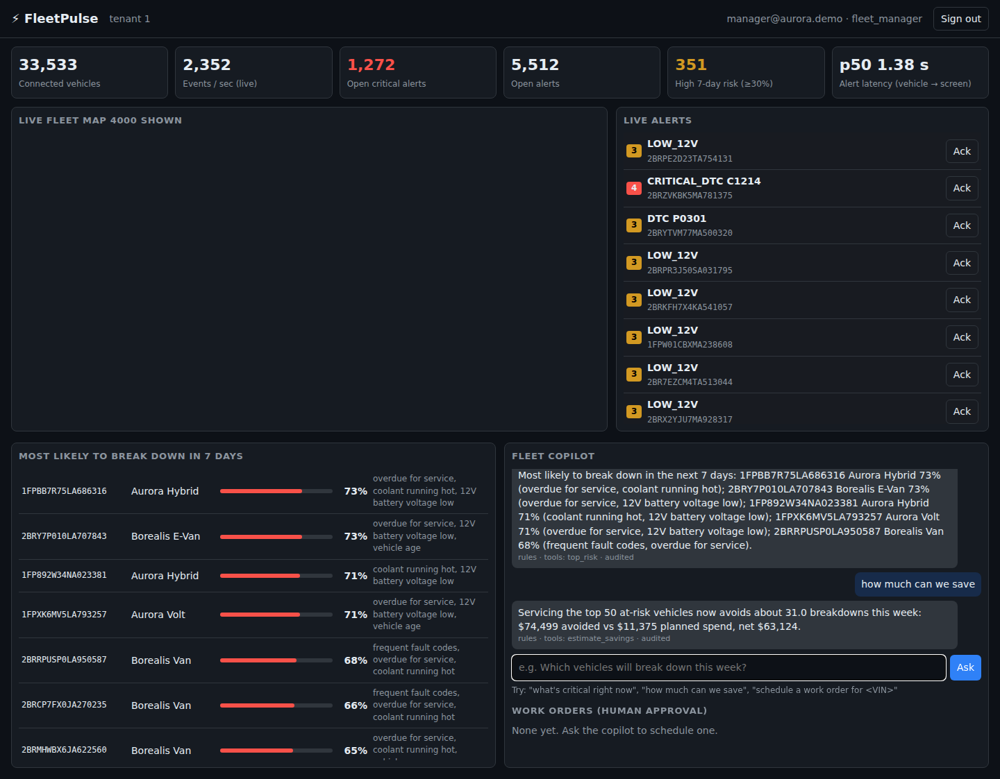
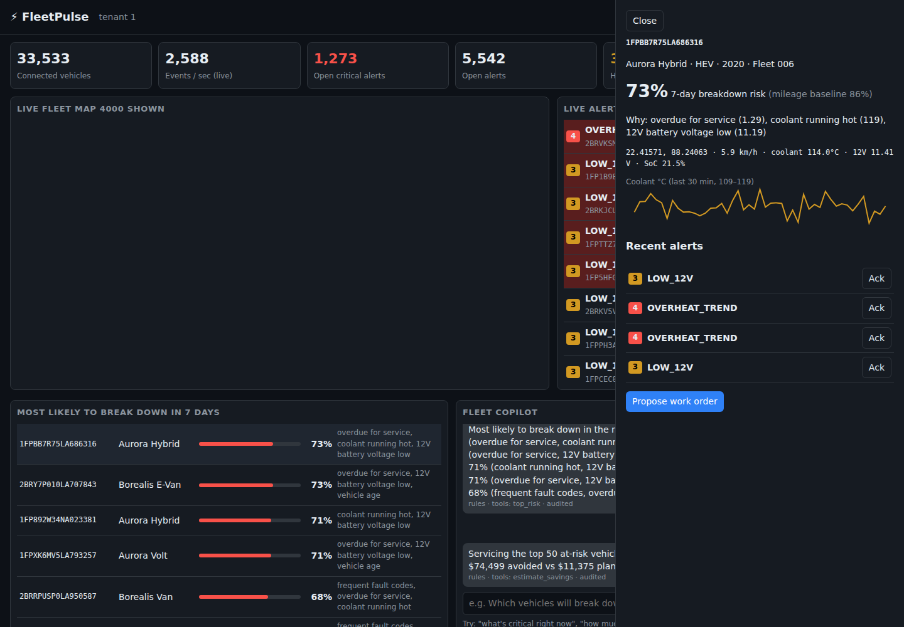
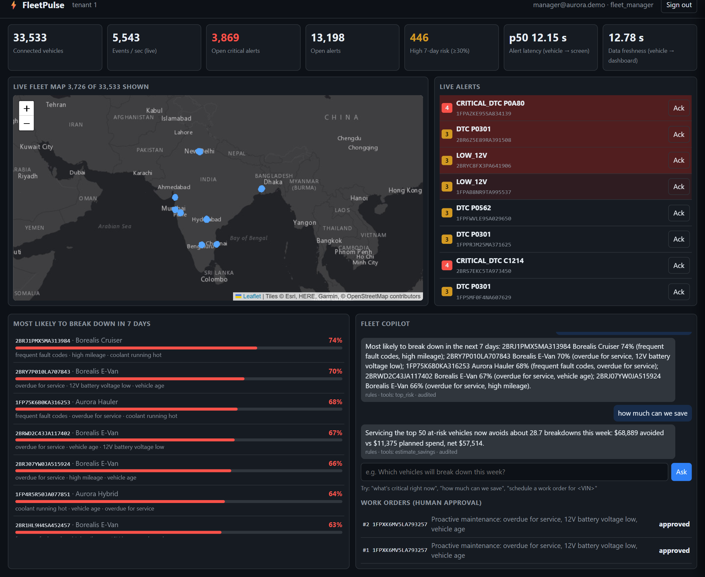
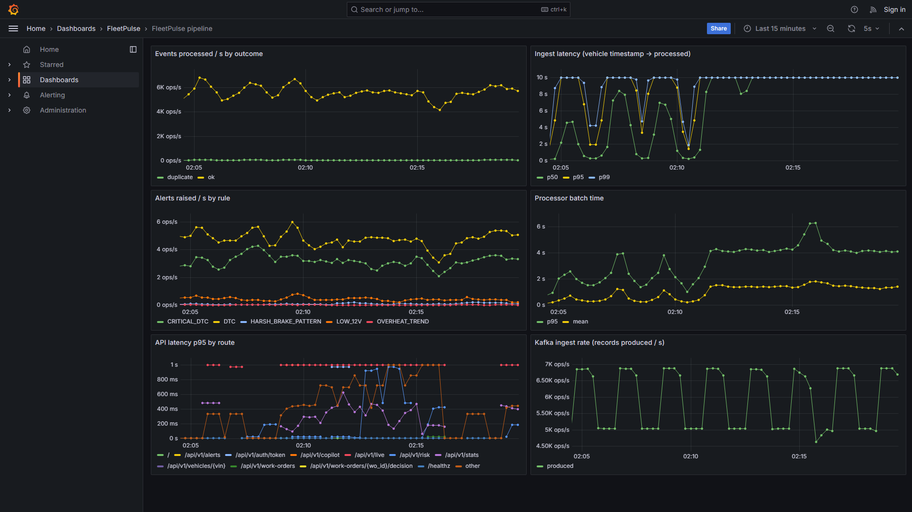
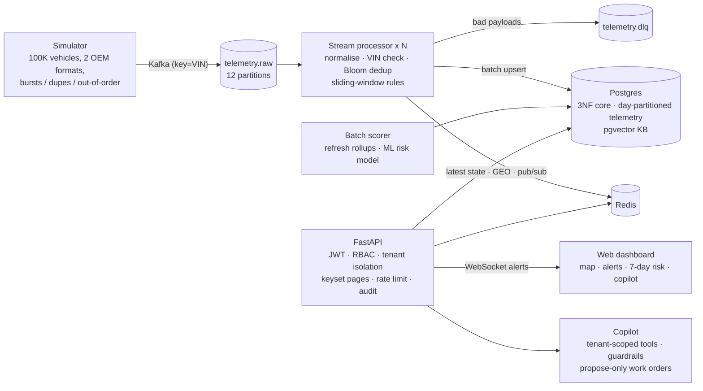

# FleetPulse: predictive maintenance for mixed ICE / EV fleets

FleetPulse tells a fleet manager **which vehicles will break down in the next 7 days, why, what to do, and what it
saves**, and raises critical faults (overheating, HV isolation, brake relay…) on screen in **~0.2 s** (p50; p95 2.6 s through a 3x traffic burst).
It runs end to end on simulated telemetry from **100,000 vehicles** across two OEM payload formats.

Built for the Connected Vehicle Intelligence Hackathon (Motorq used as industry reference only; no affiliation).

**Explainer video:** https://drive.google.com/file/d/1R0No_tNViiExbQ-IPfvOw9y1ivHt7P9Z/view?usp=sharing  
**Solution Document:** [docs/solution/FleetPulse_Solution_Document.pdf](docs/solution/FleetPulse_Solution_Document.pdf)



| Vehicle drawer: risk, reasons, trends | Copilot + human-approved work orders | Grafana pipeline dashboard |
|---|---|---|
|  |  |  |

## Quick start

```bash
cp .env.example .env            # optional overrides
docker compose up --build       # seeds 100K vehicles, starts simulator -> Kafka -> processor -> Postgres/Redis -> API
open http://localhost:8000      # manager@aurora.demo / demo1234  (analyst@aurora.demo sees masked locations)
docker compose --profile observability up -d prometheus grafana   # metrics at :9090, "FleetPulse pipeline" dashboard at :3000
```

Optional: set `ANTHROPIC_API_KEY` to let Claude plan the copilot's tool calls (it falls back to a deterministic planner).

## Architecture



Per-hop latency (measured locally): vehicle → Kafka ~20 ms (linger) · processor batch ~0.1-0.2 s (alerts pushed before the bulk telemetry insert) · Redis pub/sub → WebSocket < 50 ms.

| Store | Holds | CAP |
|---|---|---|
| Postgres (3NF) | tenants, users, fleets, vehicles, drivers, subscriptions, alerts, work orders, risk scores, audit log | CP |
| Postgres (partitioned) | raw telemetry in hourly partitions (hot, 2 h retention) + `vehicle_daily` incremental rollup (warm, kept) | AP via Kafka buffering |
| Redis | live state, geo index, rate limits, alert pub/sub, cache | AP |
| pgvector | fault / repair knowledge embeddings for the copilot | CP |

See [PROJECT_CONTEXT.md](PROJECT_CONTEXT.md) for the project history, status and roadmap, [docs/adr](docs/adr) for decisions and [docs/threat-model.md](docs/threat-model.md) for STRIDE.

## Results (all from this repo, see `docs/evidence/`)

| What | Result |
|---|---|
| Fleet seeded | 100,000 vehicles, 33,333 drivers, 3 tenants in 3.4 s (COPY) |
| End-to-end throughput | zero loss at 12.8K and 25.7K ev/s offered with 3x bursts (`tests/load/pipeline_load.py`); Kafka absorbs 69K ev/s, processing ceiling ~24K ev/s on one laptop Postgres; demo default 5K ev/s |
| Data freshness | vehicle → dashboard p50 ~0.15 s (target < 2 s), live KPI on the dashboard |
| Critical alert latency | vehicle → screen p50 0.17 s, p95 2.6 s, max 3.2 s across a 3x burst (target < 5 s) |
| Batch scoring | 100,000 vehicles scored in ~10 s, flat as history grows (incremental rollup) |
| ML vs baseline | ROC-AUC 0.878 vs 0.688; precision@top-2% 27.8% vs 6.6% (4.2x) |
| API (4 workers, pipeline running on the same box) | p95 110 ms / p99 132 ms at 50 concurrent users; p95 224 ms at 100 |
| Query tuning | vehicle telemetry 174 ms → 0.58 ms; top-risk 27 ms → 0.40 ms; open alerts 2.7 ms → 0.15 ms |
| Tests | 50 unit (98% on all domain modules) + 8 integration + 10 contract + 6 BDD scenarios against the live stack; chaos recovery ~26 s |
| Portability | production K8s manifests deployed unchanged (config-only overlay) on kind in CI |
| Soak (45 min) | 15.8M events, no restarts, freshness p50 0.19 s; bursts slow to 3-10 s once the hourly partition outgrows cache (~25 min in), see `docs/evidence/soak.txt` |

## Repository layout

```
fleetpulse/core        VIN, DTC parsing, Bloom/CMS/top-K/sliding windows, geohash, Dijkstra, DP trip segmentation, OEM adapters, security
fleetpulse/simulator   fleet generator, seeder, telemetry simulator
fleetpulse/processor   rule engine + Kafka consumer
fleetpulse/ml          features, training (vs baseline), batch scoring
fleetpulse/agent       copilot + guardrails
fleetpulse/api         FastAPI app (REST + WebSocket)
web/                   dashboard (single page, no build step)
db/                    schema (3NF, pgvector) + data lifecycle (hourly partitions, retention, rollup)
infra/                 k8s manifests, Terraform (AWS), Prometheus/Grafana
tests/                 unit, integration, contract, acceptance (BDD), load
docs/                  ADRs, threat model, solution document, evidence, demo script
```

## Tests

```bash
pip install -r requirements.txt pytest pytest-cov pytest-bdd httpx
pytest --cov                                              # unit + coverage
pytest -m integration tests/integration tests/contract tests/acceptance -o addopts=""   # against docker compose
docker compose -f docker-compose.yml -f tests/load/compose.loadtest.yml up -d api   # lift the rate limit
python tests/load/api_load.py http://localhost:8000 8000 50 4       # (best run inside the compose network)
python tests/load/pipeline_load.py --rate 25000 --duration 120 --processors 12   # zero-loss throughput test
python tests/load/soak.py 45                                        # soak: throughput, freshness, lag, memory
PYTHONPATH=. python tests/load/processor_bench.py
```

## Data lifecycle and disk

At the default 5,000 events/s raw telemetry is about 5 GB per hour in Postgres. The batch job keeps only the last
`TELEMETRY_RETENTION_HOURS` (default 2) of raw rows by dropping whole hourly partitions, and folds every row into the
`vehicle_daily` rollup first, so risk features (7-day windows) survive the drop. Lower `EVENTS_PER_SEC` on a small laptop.

## Known gaps (honest)

- 100K events/s is not reached on one laptop: the pipeline sustains ~24K events/s with zero loss and Kafka buffers
  69K/s, with the single Postgres primary as the ceiling. Moving raw telemetry to ClickHouse/Scylla is ADR-0002's next step.
- Device mTLS, Keycloak/OIDC and Vault are designed (threat model, K8s/Terraform) but the demo uses HS256 JWT with a local user table.
- The ML model is trained on simulated history from the same wear model the simulator uses; real-world validation is future work.
- Terraform is provided for AWS only and has not been applied.

## Declarations

All data is synthetic. Built with AI assistance (Claude) for code and documentation. Open-source components:
FastAPI, Uvicorn, psycopg, Redis, confluent-kafka (librdkafka), scikit-learn, NumPy, PyJWT, prometheus-client,
Leaflet, Redpanda, PostgreSQL, pgvector, pytest-bdd. Map tiles: Esri World Dark Gray Canvas (OpenStreetMap fallback).
